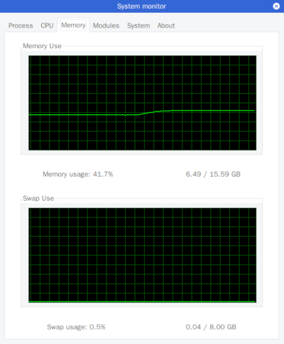
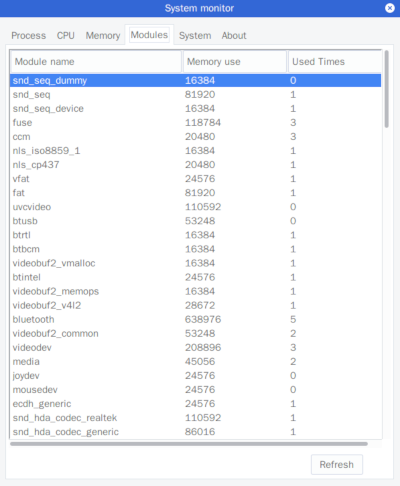
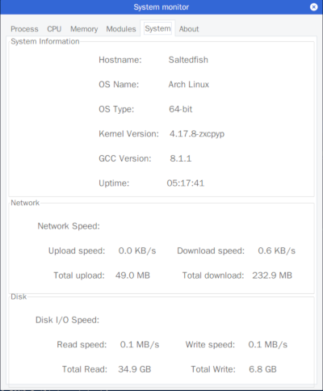

# Part IV: Implement a system monitor

## Page 1： Process information

### Screenshot


### Get data

The process information can be found in `/proc/$PID/stat`.

The stat file can like this:

```sh
linux > cat /proc/1/stat
1 (systemd) S 0 1 1 0 -1 4194560 11641 18392752 215 1926 178 169 26834 14961 20 0 1 0 2 240078848 1373 18446744073709551615 1 1 0 0 0 0 671173123 4096 1260 0 0 0 17 4 0 0 53 0 0 0 0 0 0 0 0 0 0
```

We need the 1st, 2nd, 3rd, 4th, 18th, 23th data for pid, name, status, ppid, priority, memory

## Page 2: CPU information

### Screenshot


### Get data

The CPU information can be found in `/proc/cpuinfo`.

* model name: line 5
* cpu MHz: line 8
* cache size: line 9
* cpu cores: line 13
* address sizes: line 25

The CPU utilization can be calculated as follows.

cpu(total) = user + nice + system + idle

utilization = 100% * (△total – △idle) / △total

user nice system and idle can be found as first four number in `/proc/stat`.

## Page 3: Memory information

### Screenshot



### Get data

The Memory information can be found in `/proc/meminfo`.

* MemTotal: line 1
* MemFree: line 2
* SwapTotal: line 15
* SwapFree: line 16

## Page 4: Modules information

### Screenshot



### Get data

The modules information can be found in `/proc/modules`.

We need 1st, 2nd, 3rd data for modules name, used memory and used times.

## Page 5: System infor mation

### Screenshot



### Get data

The system information can be found as follows:

* Hostname:  `/etc/hostnames`.
* OS Name:  `/etc/issue`.
* OS Type:  `sizeof(char *) * 8`;
* Kernel Version:  `/proc/sys/kernel/osrelease`.
* GCC Version:  `/proc/version`.
* Uptime:  `/proc/uptime`.

The Network information can be found in `/proc/net/dev`.

Use receive byte and send byte to calculate the speed.

The Dist information can be found in `/proc/diskstats`.

We need 6th, 10th data for read sectors and write sectors. The calaulate I/O speed as follows:

* read speed = (Δrd_sectors/Δt) * (block_size / 1024)
* write speed = (Δwr_sectors/Δt) * (block_size / 1024)

(Here block_size is 512)

## Page 6: About


