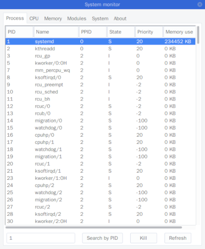
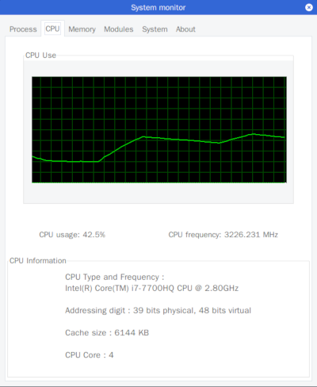

# HUST-OS-design
HUST Operating System curriculum design 2018 Summer.

## About

Environment: Arch Linux x86_64

Kernel version: 4.17.8

CMake minimum required: version 3.9

## Compile

```sh
mkdir build
cd build
cmake ..
make
```

## Part I: Linux basics

1. Implement a program to copy file.
2. Implement a fork demo using GTK+ 2.0

## Part II: Syscall

Adding a system call to copy file in linux kernel.

Here I use ***Arch Linux x86_64*** and ***kernel 4.17.8***, it may be a little diffient from the way it used to be on ***Ubuntu*** or ***Linux kernel version <= 4.15*** because of the fucking NVIDIA. I need to install the Kernel Image manually, and fix the NVIDIA driver after install the new kernel.

The details can be seen [here](PartII-Syscall)

## Part III: Character Device driver

Implement a character device driver by linux kernel module.

Here I added read, write, lseek, ioctl(for clear) functions. And the device driver can auto create and delete device file when load or unload the module.

The details can be seen [here](PartIII-Device_driver)

## Part IV: Implement a system monitor

Here I use GTK+ 2.0 for the graphical interface.

Information got from `/proc` and `/etc`.

Here are two screenshot for the system monitor.

The details can be seen [here](PartIV-System_monitor)

<div align="center">
  &nbsp;&nbsp;&nbsp;&nbsp;
</div>